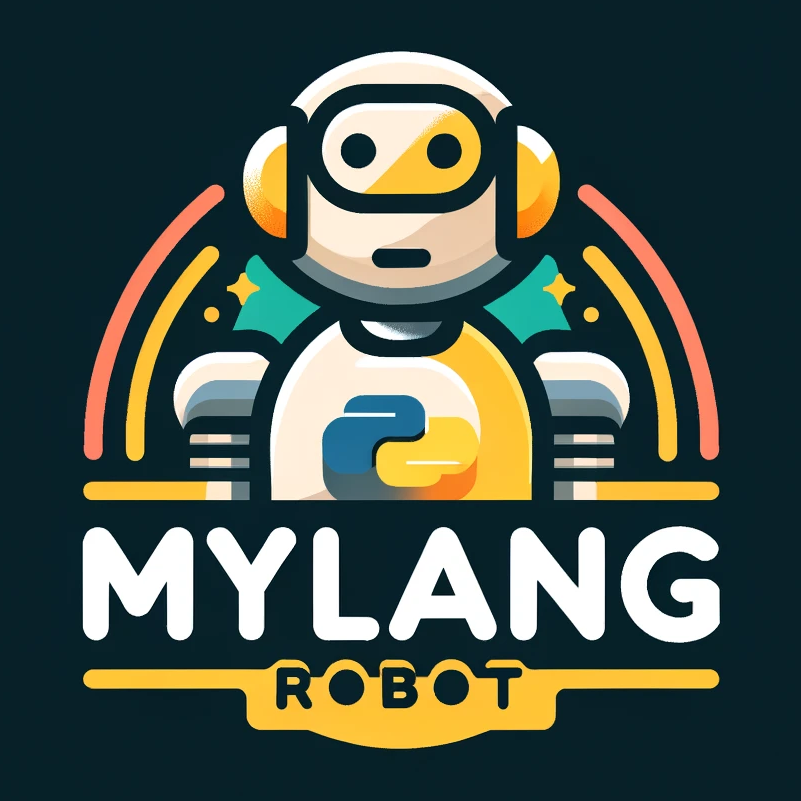

<h1 align="center">
  <br>
  
  <br>
</h1>

## Introduction

This is a repository for conducting interactions with robots using language. Using myCobot, pick and place tasks are achieved through verbal interactions with humans.
By utilizing ChatGPT for image interpretation, generating pick and place programs, and creating additional questions for ambiguous instructions, we accomplish the targeted tasks.

For image interpretation, [SoM](https://som-gpt4v.github.io/) is used. This enables more specific object designation by GPT-4V by using images that overlay numbers on segmented images.

## Installation

```sh
sudo apt install portaudio19-dev
git clone https://github.com/neka-nat/lang-robotics.git
cd lang-robotics
pip install -e .  # or poetry install
```

## Environment Settings

```sh
cp .env.sample .env
# Edit .env
# OPENAI_API_KEY=<your api key>
```

## Demo

```sh
sudo chmod 666 /dev/ttyUSBxxx
cd scripts
python demo.py
```

## Related links

* [Set-of-Mark-Visual-Prompting-for-GPT-4V](https://github.com/microsoft/SoM)
* [SoM demo](https://github.com/SkalskiP/SoM)
* [Segment Anything](https://github.com/facebookresearch/segment-anything)
* [PromptCraft-Robotics](https://github.com/microsoft/PromptCraft-Robotics)
