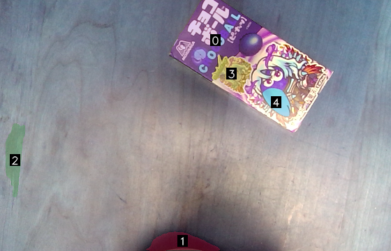

<h1 align="center">
  <br>
  
  <br>
</h1>

## Introduction

This is a repository for conducting interactions with robots using language. Using myCobot, pick and place tasks are achieved through verbal interactions with humans.
By utilizing ChatGPT for image interpretation, generating pick and place programs, and creating additional questions for ambiguous instructions, we accomplish the targeted tasks.

For image interpretation, [SoM](https://som-gpt4v.github.io/) is used. This enables more specific object designation by GPT-4V by using images that overlay numbers on segmented images.

## Installation

```sh
sudo apt install portaudio19-dev
git clone https://github.com/neka-nat/lang-robotics.git
cd lang-robotics
pip install -e .  # or poetry install
```

## Environment Settings

```sh
cp .env.sample .env
# Edit .env
# OPENAI_API_KEY=<your api key>
```

## Demo

```sh
sudo chmod 666 /dev/ttyUSBxxx
cd scripts
python demo.py
```

## Results

### Captured image and Annotated image




### Generated program

```
move_to_object(4)
grab()
move_to_place('drop')
release()
```

### Generated motion

https://github.com/neka-nat/mylangrobot/assets/991515/858ae25a-405a-4ad1-afc2-fbf6934adac3

## Settings

You can configure the robot using the `configs/settings.yml` file.
Please set the connection port with the robot, the camera ID, the suction pin number, and other hardware-related settings according to your own environment.

```yaml
pixel_size_on_capture_position: 0.00043  # [m/pixel]
interface_type: "AUDIO"
camera_id: 0
language: "Japanese"
mycobot_settings:
  urdf_path: "../data/mycobot/mycobot.urdf"
  end_effector_name: "camera_flange"
  port: "/dev/ttyACM0"
  baud: 115200
  default_speed: 40
  default_z_speed: 20
  suction_pin: 5
  command_timeout: 5
  use_gravity_compensation: false
  end_effector_height: 0.065  # pump head offset
  object_height: 0.01
  release_height: 0.05
  positions:
    home: [0, 20, -130, 20, 0, 0]
    capture: [0, 0, -30, -60, 0, -45]
    drop: [-45, 20, -130, 20, 0, 0]
```

## Related links

* [Set-of-Mark-Visual-Prompting-for-GPT-4V](https://github.com/microsoft/SoM)
* [SoM demo](https://github.com/SkalskiP/SoM)
* [Segment Anything](https://github.com/facebookresearch/segment-anything)
* [PromptCraft-Robotics](https://github.com/microsoft/PromptCraft-Robotics)
